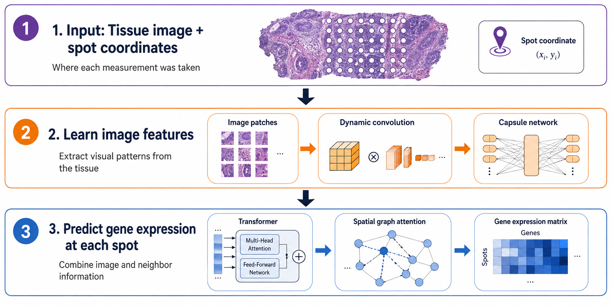

This is a hybrid neural network that leverages dynamic convolution and capsule networks to adaptively perceive
latent molecular signals from histological images, for the systematic analysis of spatial gene expression within tissue
pathology. THItoGene integrates gene expression, spatial locations, and histological images to explore and analyze the
relationship between high-resolution pathological image phenotypes and tumor genetic morphology.



## Project Structure

| File                                   | Description                                                          |
|-----------------------------------------|------------------------------------------------------------------------|
| `spatial_gene_expression_dataset.py`    | PyTorch `Dataset` classes for HER2ST, skin (GSE144240), and 10x Visium |
| `spot_knn_graph_builder.py`             | Builds the k-nearest-neighbor spot graph (`calcADJ`)                   |
| `capsule_network_model.py`              | Efficient Capsule Network (patch feature encoder)                      |
| `graph_attention_layer.py`              | Graph Attention Network layer (`MultiHeadGAT`)                         |
| `omni_dimensional_dynamic_conv.py`      | Omni-Dimensional Dynamic Convolution (`ODConv2d`)                       |
| `vision_transformer_blocks.py`          | Transformer / self-attention blocks (`ViT`)                            |
| `thitogene_full_model.py`               | Full assembled model (`THItoGene`)                                     |
| `gene_expression_inference.py`          | Inference helpers (`model_predict`, `sr_predict`)                      |
| `genomics_analysis_utils.py`            | Preprocessing, clustering, scoring utilities (`get_R`, etc.)            |
| `train_and_evaluate_thitogene.py`       | Cross-validation training and evaluation script                        |

## Environment

The required environment has been packaged in the [`requirements.txt`](./requirements.txt) file.
Please run the following command to install.

```commandline
cd THItoGene
pip install -r requirements.txt
```

## Datasets

- Human HER2-positive breast tumor ST data: https://github.com/almaan/her2st/
- Human cutaneous squamous cell carcinoma 10x Visium data (GSE144240)
- All datasets can also be downloaded from [Synapse](https://www.synapse.org/#!Synapse:syn52503858/files/)

## Trained Models

Trained models for both the HER2+ and cSCC datasets are available on
[Synapse](https://www.synapse.org/#!Synapse:syn52503858/files/).

## Usage

> Download the trained models and datasets first, and extract them into the corresponding folders.

```python
import torch
from torch.utils.data import DataLoader

from spatial_gene_expression_dataset import ViT_HER2ST
from gene_expression_inference import model_predict
from genomics_analysis_utils import *
from thitogene_full_model import THItoGene

test_sample_ID = 0
dataset_name = 'her2st'

# Load a trained model (unzip the trained model into the model/ folder first)
model = THItoGene.load_from_checkpoint(
    f"model/THItoGene_{dataset_name}_{test_sample_ID}.ckpt", n_genes=785,
    learning_rate=1e-5, route_dim=64, caps=20, heads=[16, 8],
    n_layers=4)
device = torch.device('cuda' if torch.cuda.is_available() else 'cpu')

# Load the test split
dataset = ViT_HER2ST(train=False, sr=False, fold=test_sample_ID)
test_loader = DataLoader(dataset, batch_size=1, num_workers=0)

# Predict and evaluate
adata_pred, adata_truth = model_predict(model, test_loader, attention=False, device=device)
R, p_val = get_R(adata_pred, adata_truth)
print('Mean Pearson Correlation:', np.nanmean(R))
print('-log10p_val:', -np.log10(p_val))
```

## Parameters

| Parameter       | Type  | Default    | Description                                             |
|-----------------|-------|------------|----------------------------------------------------------|
| `n_genes`       | int   | —          | Number of genes to predict                                |
| `learning_rate` | float | `1e-5`     | Learning rate (range `[0, 1]`)                             |
| `route_dim`     | int   | `64`       | Capsule network routing vector dimension                   |
| `heads`         | list  | `[16, 8]`  | Number of heads for the ViT module and the GAT module      |
| `n_layers`      | int   | `4`        | Number of Transformer blocks                                |
| `caps`          | int   | `20`       | Number of capsule network routing capsules                 |

## Pipeline

To run the full pipeline from scratch:

1. Run [`download.sh`](./data/download.sh) in the [`data`](./data) folder
   (or run `git clone https://github.com/almaan/her2st.git` inside `data/`).
2. Run `gunzip *.gz` in `./data/her2st/data/ST-cnts/` to unzip the count files.

### Training

```python
import pytorch_lightning as pl
from torch.utils.data import DataLoader

from spatial_gene_expression_dataset import ViT_HER2ST
from thitogene_full_model import THItoGene

fold = 0
tag = '-htg_her2st_785_32_cv'
dataset = ViT_HER2ST(train=True, fold=fold)
train_loader = DataLoader(dataset, batch_size=1, num_workers=0, shuffle=True)
model = THItoGene(n_genes=785, learning_rate=1e-5, route_dim=64, caps=20, heads=[16, 8], n_layers=4)
trainer = pl.Trainer(accelerator="gpu", devices=[0], max_epochs=200)
trainer.fit(model, train_loader)
trainer.save_checkpoint("model/last_train_" + tag + '_' + str(fold) + ".ckpt")
```

### Prediction

```python
import torch
from torch.utils.data import DataLoader

from spatial_gene_expression_dataset import ViT_HER2ST
from gene_expression_inference import model_predict
from genomics_analysis_utils import *
from thitogene_full_model import THItoGene

fold = 0
tag = '-htg_her2st_785_32_cv'
model = THItoGene.load_from_checkpoint("model/last_train_" + tag + '_' + str(fold) + ".ckpt", n_genes=785,
                                       learning_rate=1e-5, route_dim=64, caps=20, heads=[16, 8],
                                       n_layers=4)
device = torch.device('cuda' if torch.cuda.is_available() else 'cpu')
dataset = ViT_HER2ST(train=False, sr=False, fold=fold)
test_loader = DataLoader(dataset, batch_size=1, num_workers=4)
adata_pred, adata_truth = model_predict(model, test_loader, attention=False, device=device)
R, p_val = get_R(adata_pred, adata_truth)
print('Mean Pearson Correlation:', np.nanmean(R))
print('-log10p_val:', -np.log10(p_val))
```

## Citation

Jia et al. "THItoGene: a deep learning method for predicting spatial transcriptomics from histological images."
Briefings in Bioinformatics vol. 25,1 (2024). [Paper](https://doi.org/10.1093/bib/bbad464).
